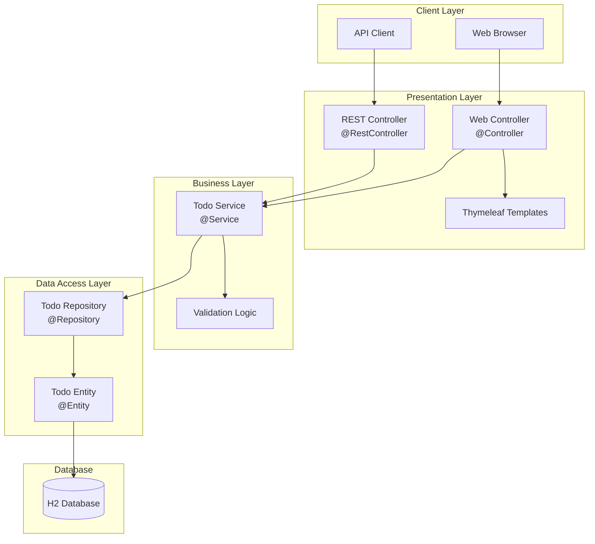

# 設計文書 - Spring Boot Todo管理アプリケーション

## 概要

本システムはSpring Boot 3.xフレームワークを基盤とした、レイヤードアーキテクチャパターンを採用したTodo管理Webアプリケーションです。H2組み込みデータベースによる永続化、RESTful APIとThymeleafベースのWebインターフェースを提供し、MVCパターンに基づいた明確な責務分離と高い保守性を実現します。

## アーキテクチャ

### システム構成



### アーキテクチャパターン

**レイヤードアーキテクチャ + MVCパターン**

選定理由：
- Spring Bootの標準的なアーキテクチャパターンとの親和性
- 各層の責務が明確で理解しやすい
- 保守性と拡張性のバランスが良い
- 小〜中規模アプリケーションに最適

層構成：
1. **Presentation Layer**: ユーザーインターフェースとAPI提供
2. **Business Layer**: ビジネスロジックとバリデーション
3. **Data Access Layer**: データ永続化とエンティティ管理
4. **Infrastructure Layer**: 設定、ログ、例外処理

### 技術構成

| レイヤー | 技術 | 役割 | 選定理由 |
|---------|------|------|----------|
| Web Framework | Spring Boot 3.x | アプリケーション基盤 | 自動設定、組み込みサーバー、豊富なエコシステム |
| View | Thymeleaf | HTMLテンプレートエンジン | Spring統合、自然なテンプレート記法 |
| ORM | Spring Data JPA | データアクセス抽象化 | リポジトリパターンの自動実装 |
| Database | H2 Database | 組み込みデータベース | 設定不要、開発環境に最適 |
| Build | Maven/Gradle | ビルド・依存管理 | 標準的なビルドツール |
| Test | JUnit 5 + MockMvc | テスティング | Spring Boot Test統合 |

## システム設計

### モジュール構成

```
todo-app-springboot/
├── src/main/java/com/example/todoapp/
│   ├── controller/           # Presentation Layer
│   │   ├── TodoWebController.java
│   │   └── TodoRestController.java
│   ├── service/              # Business Layer
│   │   ├── TodoService.java
│   │   └── impl/
│   │       └── TodoServiceImpl.java
│   ├── repository/           # Data Access Layer
│   │   └── TodoRepository.java
│   ├── entity/               # Domain Model
│   │   └── Todo.java
│   ├── dto/                  # Data Transfer Objects
│   │   ├── TodoRequest.java
│   │   ├── TodoResponse.java
│   │   └── TodoSearchCriteria.java
│   ├── exception/            # Exception Handling
│   │   ├── TodoNotFoundException.java
│   │   └── GlobalExceptionHandler.java
│   ├── config/               # Configuration
│   │   ├── DatabaseConfig.java
│   │   └── WebConfig.java
│   └── TodoApplication.java  # Main Application
├── src/main/resources/
│   ├── templates/            # Thymeleaf Templates
│   │   ├── layout/
│   │   │   └── layout.html
│   │   ├── todo/
│   │   │   ├── list.html
│   │   │   ├── detail.html
│   │   │   ├── form.html
│   │   │   └── search.html
│   │   └── error/
│   │       ├── 404.html
│   │       └── 500.html
│   ├── static/               # Static Resources
│   │   ├── css/
│   │   │   └── style.css
│   │   └── js/
│   │       └── app.js
│   ├── application.properties
│   ├── application-dev.properties
│   ├── application-prod.properties
│   └── logback-spring.xml
└── src/test/java/
    └── com/example/todoapp/
        ├── controller/
        ├── service/
        └── repository/
```

### コンポーネント設計

#### 1. Controller層

**TodoWebController**
```java
Component: TodoWebController
Responsibility: Web画面のリクエスト処理とビュー制御

Interface:
  operations:
    - showList(Model model, Pageable pageable) -> String
    - showDetail(@PathVariable Long id, Model model) -> String
    - showCreateForm(Model model) -> String
    - create(@Valid TodoRequest request, BindingResult result) -> String
    - showEditForm(@PathVariable Long id, Model model) -> String
    - update(@PathVariable Long id, @Valid TodoRequest request) -> String
    - delete(@PathVariable Long id, RedirectAttributes attributes) -> String
    - search(TodoSearchCriteria criteria, Model model) -> String

Dependencies:
  - TodoService: ビジネスロジック処理
  - TodoMapper: DTO変換

Mapping:
  - GET /todos -> showList
  - GET /todos/{id} -> showDetail
  - GET /todos/new -> showCreateForm
  - POST /todos -> create
  - GET /todos/{id}/edit -> showEditForm
  - PUT /todos/{id} -> update
  - DELETE /todos/{id} -> delete
  - GET /todos/search -> search
```

**TodoRestController**
```java
Component: TodoRestController
Responsibility: RESTful API エンドポイント提供

Interface:
  operations:
    - getAllTodos(Pageable pageable) -> ResponseEntity<Page<TodoResponse>>
    - getTodoById(@PathVariable Long id) -> ResponseEntity<TodoResponse>
    - createTodo(@Valid @RequestBody TodoRequest request) -> ResponseEntity<TodoResponse>
    - updateTodo(@PathVariable Long id, @Valid @RequestBody TodoRequest) -> ResponseEntity<TodoResponse>
    - deleteTodo(@PathVariable Long id) -> ResponseEntity<Void>
    - searchTodos(TodoSearchCriteria criteria) -> ResponseEntity<List<TodoResponse>>

Dependencies:
  - TodoService: ビジネスロジック処理

Mapping:
  - GET /api/todos -> getAllTodos
  - GET /api/todos/{id} -> getTodoById
  - POST /api/todos -> createTodo
  - PUT /api/todos/{id} -> updateTodo
  - DELETE /api/todos/{id} -> deleteTodo
  - GET /api/todos/search -> searchTodos
```

#### 2. Service層

**TodoService**
```java
Component: TodoService
Responsibility: Todoに関するビジネスロジックの実装

Interface:
  operations:
    - findAll(Pageable pageable) -> Page<Todo>
    - findById(Long id) -> Todo
    - create(TodoRequest request) -> Todo
    - update(Long id, TodoRequest request) -> Todo
    - delete(Long id) -> void
    - search(TodoSearchCriteria criteria) -> List<Todo>
    - updateStatus(Long id, TodoStatus status) -> Todo
    - findByStatus(TodoStatus status) -> List<Todo>
    - findOverdueTodos() -> List<Todo>

Dependencies:
  - TodoRepository: データアクセス
  - TodoValidator: ビジネスルール検証

Business Rules:
  - タイトルは必須かつ100文字以内
  - 説明は500文字以内
  - ステータス変更は定義された遷移ルールに従う
  - 期限切れTodoの自動通知
```

#### 3. Repository層

**TodoRepository**
```java
Component: TodoRepository
Responsibility: Todoエンティティのデータアクセス処理

Interface (extends JpaRepository):
  operations:
    - findAll() -> List<Todo>
    - findById(Long id) -> Optional<Todo>
    - save(Todo todo) -> Todo
    - deleteById(Long id) -> void
    - findByStatus(TodoStatus status) -> List<Todo>
    - findByTitleContainingOrDescriptionContaining(String title, String description) -> List<Todo>
    - findByDueDateBefore(LocalDate date) -> List<Todo>
    - countByStatus(TodoStatus status) -> Long

Query Methods:
  - @Query("SELECT t FROM Todo t WHERE t.dueDate < :date AND t.status != 'DONE'")
    findOverdueTodos(@Param("date") LocalDate date) -> List<Todo>
```

### データフロー

#### Todo作成フロー
```
Flow: CreateTodoFlow
Trigger: ユーザーがTodo作成フォームを送信

Steps:
  1. リクエスト受信 (TodoWebController/TodoRestController)
     - バリデーション実行
     - TodoRequestオブジェクト生成
  
  2. ビジネスロジック処理 (TodoService)
     - ビジネスルール検証
     - Todoエンティティ生成
     - 作成日時・更新日時の自動設定
  
  3. データ永続化 (TodoRepository)
     - JPA経由でH2データベースに保存
     - 自動生成IDの取得
  
  4. レスポンス返却 (Controller)
     - Web: リダイレクト + フラッシュメッセージ
     - API: 201 Created + TodoResponse

Data Transformation:
  Input: TodoRequest (title, description, status, priority, dueDate)
  Processing: Todo Entity (+ id, createdAt, updatedAt)
  Output: TodoResponse / View Model

Error Scenarios:
  - バリデーションエラー -> 400 Bad Request / フォーム再表示
  - データベースエラー -> 500 Internal Server Error
```

## データ設計

### データモデル

```
Entity: Todo
Attributes:
  - id: Long [primary_key, auto_generated]
  - title: String(100) [not_null]
  - description: String(500) [nullable]
  - status: TodoStatus [not_null, default='TODO']
  - priority: TodoPriority [not_null, default='MEDIUM']
  - dueDate: LocalDate [nullable]
  - createdAt: LocalDateTime [not_null, auto_generated]
  - updatedAt: LocalDateTime [not_null, auto_updated]

Enums:
  TodoStatus: TODO, IN_PROGRESS, DONE
  TodoPriority: LOW, MEDIUM, HIGH

Business Rules:
  - titleは必須かつ100文字以内
  - descriptionは500文字以内
  - statusの遷移: TODO -> IN_PROGRESS -> DONE
  - createdAtは作成時に自動設定
  - updatedAtは更新時に自動更新
```

### データベース設計

#### テーブル定義

```sql
CREATE TABLE todo (
    id BIGINT AUTO_INCREMENT PRIMARY KEY,
    title VARCHAR(100) NOT NULL,
    description VARCHAR(500),
    status VARCHAR(20) NOT NULL DEFAULT 'TODO',
    priority VARCHAR(10) NOT NULL DEFAULT 'MEDIUM',
    due_date DATE,
    created_at TIMESTAMP NOT NULL DEFAULT CURRENT_TIMESTAMP,
    updated_at TIMESTAMP NOT NULL DEFAULT CURRENT_TIMESTAMP ON UPDATE CURRENT_TIMESTAMP,
    
    CONSTRAINT chk_status CHECK (status IN ('TODO', 'IN_PROGRESS', 'DONE')),
    CONSTRAINT chk_priority CHECK (priority IN ('LOW', 'MEDIUM', 'HIGH'))
);
```

#### インデックス設計

```sql
-- ステータスによる検索の高速化
CREATE INDEX idx_todo_status ON todo(status);

-- 期限による検索の高速化
CREATE INDEX idx_todo_due_date ON todo(due_date);

-- タイトル検索の高速化
CREATE INDEX idx_todo_title ON todo(title);

-- 複合インデックス（ステータスと期限）
CREATE INDEX idx_todo_status_due ON todo(status, due_date);
```

### データアクセスパターン

```java
// Repository層でのデータアクセスパターン
@Repository
public interface TodoRepository extends JpaRepository<Todo, Long> {
    
    // ページング対応
    Page<Todo> findAll(Pageable pageable);
    
    // 動的クエリ（Specification使用）
    Page<Todo> findAll(Specification<Todo> spec, Pageable pageable);
    
    // キャッシュ対応
    @Cacheable("todos")
    Optional<Todo> findById(Long id);
    
    // バッチ処理対応
    @Modifying
    @Query("UPDATE Todo t SET t.status = :status WHERE t.id IN :ids")
    void updateStatusBatch(@Param("ids") List<Long> ids, @Param("status") TodoStatus status);
}
```

## インターフェース設計

### 外部インターフェース（REST API）

#### API仕様

**Todo一覧取得**
```yaml
endpoint: GET /api/todos
parameters:
  - page: integer (default=0)
  - size: integer (default=20)
  - sort: string (default="createdAt,desc")
response:
  status: 200 OK
  body:
    content: [TodoResponse]
    totalElements: integer
    totalPages: integer
    number: integer
    size: integer
example:
  response:
    {
      "content": [
        {
          "id": 1,
          "title": "サンプルタスク",
          "description": "説明文",
          "status": "TODO",
          "priority": "HIGH",
          "dueDate": "2024-12-31",
          "createdAt": "2024-01-01T10:00:00",
          "updatedAt": "2024-01-01T10:00:00"
        }
      ],
      "totalElements": 100,
      "totalPages": 5,
      "number": 0,
      "size": 20
    }
```

**Todo作成**
```yaml
endpoint: POST /api/todos
headers:
  Content-Type: application/json
request:
  body:
    title: string (required, max=100)
    description: string (optional, max=500)
    status: enum (TODO|IN_PROGRESS|DONE)
    priority: enum (LOW|MEDIUM|HIGH)
    dueDate: date (optional, format="yyyy-MM-dd")
response:
  status: 201 Created
  headers:
    Location: /api/todos/{id}
  body: TodoResponse
errors:
  400: Validation Error
  500: Internal Server Error
```

**Todo更新**
```yaml
endpoint: PUT /api/todos/{id}
headers:
  Content-Type: application/json
path_parameters:
  id: Long (required)
request:
  body: TodoRequest
response:
  status: 200 OK
  body: TodoResponse
errors:
  400: Validation Error
  404: Todo Not Found
  500: Internal Server Error
```

**Todo削除**
```yaml
endpoint: DELETE /api/todos/{id}
path_parameters:
  id: Long (required)
response:
  status: 204 No Content
errors:
  404: Todo Not Found
  500: Internal Server Error
```

#### エラーレスポンス形式

```json
{
  "timestamp": "2024-01-01T10:00:00",
  "status": 400,
  "error": "Bad Request",
  "message": "Validation failed",
  "path": "/api/todos",
  "errors": [
    {
      "field": "title",
      "message": "タイトルは必須項目です"
    },
    {
      "field": "dueDate",
      "message": "期限は未来の日付を指定してください"
    }
  ]
}
```

### 内部インターフェース

#### Service-Repository インターフェース

```java
// Service層からRepository層への呼び出し
public interface TodoDataAccess {
    Page<Todo> findAll(Pageable pageable);
    Optional<Todo> findById(Long id);
    Todo save(Todo todo);
    void deleteById(Long id);
    List<Todo> findBySearchCriteria(TodoSearchCriteria criteria);
}

// Controller層からService層への呼び出し
public interface TodoBusinessLogic {
    TodoResponse createTodo(TodoRequest request);
    TodoResponse updateTodo(Long id, TodoRequest request);
    void deleteTodo(Long id);
    Page<TodoResponse> getAllTodos(Pageable pageable);
    TodoResponse getTodoById(Long id);
}
```

## 画面設計

### 画面構成

#### 1. Todo一覧画面（/todos）

```html
Layout:
┌─────────────────────────────────────────┐
│ Header: Todo管理システム                    │
├─────────────────────────────────────────┤
│ [新規作成] [検索]                          │
├─────────────────────────────────────────┤
│ ┌─────────────────────────────────────┐ │
│ │ ID │ タイトル │ ステータス │ 優先度 │ 期限 │ │
│ ├─────────────────────────────────────┤ │
│ │ 1  │ タスク1  │ TODO     │ HIGH  │ 12/31│ │
│ │ 2  │ タスク2  │ DONE     │ LOW   │ -   │ │
│ └─────────────────────────────────────┘ │
│ [前へ] 1 2 3 4 5 [次へ]                   │
└─────────────────────────────────────────┘

Components:
- ヘッダー: システム名、ナビゲーション
- アクションボタン: 新規作成、検索
- テーブル: ソート可能なカラムヘッダー
- ページネーション: ページ番号、前後移動
- 行クリック: 詳細画面へ遷移
```

#### 2. Todo作成/編集フォーム（/todos/new, /todos/{id}/edit）

```html
Layout:
┌─────────────────────────────────────────┐
│ Header: Todo作成/編集                      │
├─────────────────────────────────────────┤
│ タイトル*: [___________________]          │
│                                          │
│ 説明:                                     │
│ [_____________________________________]  │
│ [_____________________________________]  │
│                                          │
│ ステータス: [TODO ▼]                       │
│ 優先度: [MEDIUM ▼]                        │
│ 期限: [____-__-__]                        │
│                                          │
│ [保存] [キャンセル]                         │
└─────────────────────────────────────────┘

Validation Display:
- 必須フィールド: * マーク表示
- エラー: フィールド下部に赤文字表示
- 成功: グリーンのトースト通知
```

#### 3. Todo詳細画面（/todos/{id}）

```html
Layout:
┌─────────────────────────────────────────┐
│ Header: Todo詳細                          │
├─────────────────────────────────────────┤
│ ID: 1                                     │
│ タイトル: サンプルタスク                       │
│ 説明: これはサンプルの説明文です                 │
│ ステータス: TODO                           │
│ 優先度: HIGH                              │
│ 期限: 2024-12-31                          │
│ 作成日時: 2024-01-01 10:00:00             │
│ 更新日時: 2024-01-01 10:00:00             │
│                                          │
│ [編集] [削除] [一覧へ戻る]                   │
└─────────────────────────────────────────┘

Actions:
- 編集: 編集画面へ遷移
- 削除: 確認ダイアログ表示後、削除実行
- 一覧へ戻る: 一覧画面へ遷移
```

### Thymeleafテンプレート設計

#### レイアウトテンプレート（layout.html）

```html
<!DOCTYPE html>
<html xmlns:th="http://www.thymeleaf.org"
      xmlns:layout="http://www.ultraq.net.nz/thymeleaf/layout">
<head>
    <meta charset="UTF-8">
    <title layout:title-pattern="$CONTENT_TITLE - $LAYOUT_TITLE">Todo管理システム</title>
    <link rel="stylesheet" th:href="@{/css/style.css}">
</head>
<body>
    <header>
        <nav class="navbar">
            <h1>Todo管理システム</h1>
            <ul>
                <li><a th:href="@{/todos}">一覧</a></li>
                <li><a th:href="@{/todos/new}">新規作成</a></li>
            </ul>
        </nav>
    </header>
    
    <main class="container">
        <div th:if="${successMessage}" class="alert alert-success">
            <span th:text="${successMessage}"></span>
        </div>
        <div th:if="${errorMessage}" class="alert alert-danger">
            <span th:text="${errorMessage}"></span>
        </div>
        
        <section layout:fragment="content">
            <!-- ページ固有のコンテンツ -->
        </section>
    </main>
    
    <footer>
        <p>&copy; 2024 Todo管理システム</p>
    </footer>
    
    <script th:src="@{/js/app.js}"></script>
</body>
</html>
```

## 品質設計

### エラーハンドリング

#### エラー分類と処理方針

| エラー種別 | HTTPステータス | 処理方針 | ユーザー通知 |
|-----------|--------------|----------|-------------|
| バリデーションエラー | 400 | フィールドエラー返却 | フォーム内エラー表示 |
| リソース未検出 | 404 | TodoNotFoundException | カスタム404ページ |
| 権限エラー | 403 | AccessDeniedException | エラーページ |
| システムエラー | 500 | 詳細ログ記録 | カスタム500ページ |
| DB接続エラー | 503 | リトライ処理 | メンテナンスページ |

#### GlobalExceptionHandler実装

```java
@ControllerAdvice
public class GlobalExceptionHandler {
    
    @ExceptionHandler(TodoNotFoundException.class)
    public ResponseEntity<ErrorResponse> handleNotFound(TodoNotFoundException e) {
        return ResponseEntity.status(404)
            .body(new ErrorResponse(404, e.getMessage()));
    }
    
    @ExceptionHandler(MethodArgumentNotValidException.class)
    public ResponseEntity<ErrorResponse> handleValidation(MethodArgumentNotValidException e) {
        Map<String, String> errors = e.getBindingResult()
            .getFieldErrors().stream()
            .collect(Collectors.toMap(
                FieldError::getField,
                FieldError::getDefaultMessage
            ));
        return ResponseEntity.status(400)
            .body(new ErrorResponse(400, "Validation failed", errors));
    }
    
    @ExceptionHandler(DataAccessException.class)
    public ResponseEntity<ErrorResponse> handleDataAccess(DataAccessException e) {
        log.error("Database error occurred", e);
        return ResponseEntity.status(503)
            .body(new ErrorResponse(503, "Database temporarily unavailable"));
    }
}
```

### テスト戦略

#### テストレベルと観点

| テストレベル | 対象 | テスト観点 | ツール |
|------------|------|-----------|--------|
| 単体テスト | Service, Repository | ロジック正確性、境界値 | JUnit 5, Mockito |
| 統合テスト | Controller-Service-Repository | データフロー、トランザクション | @SpringBootTest |
| APIテスト | REST Controller | エンドポイント、レスポンス | MockMvc, RestAssured |
| UIテスト | Thymeleaf Templates | 画面遷移、フォーム送信 | Selenium (optional) |

#### テストデータ戦略

```java
// テストフィクスチャー
@TestConfiguration
public class TestDataConfig {
    
    @Bean
    @Profile("test")
    public DataInitializer testDataInitializer() {
        return () -> {
            // テスト用初期データ投入
            Todo todo1 = Todo.builder()
                .title("テストTodo1")
                .status(TodoStatus.TODO)
                .priority(TodoPriority.HIGH)
                .build();
            // ...
        };
    }
}

// テストデータビルダー
public class TodoTestDataBuilder {
    public static Todo createValidTodo() {
        return Todo.builder()
            .title("Valid Title")
            .description("Valid Description")
            .status(TodoStatus.TODO)
            .priority(TodoPriority.MEDIUM)
            .build();
    }
}
```

### パフォーマンス設計

#### 性能要件と最適化戦略

| 項目 | 要件 | 最適化戦略 |
|------|------|-----------|
| 一覧表示 | 1000件/1秒以内 | ページング、インデックス、キャッシュ |
| API応答 | 平均200ms以内 | 非同期処理、コネクションプール |
| 同時接続 | 最大100ユーザー | スレッドプール調整 |
| 起動時間 | 30秒以内 | 遅延初期化、不要Bean除外 |

#### 監視項目

```yaml
monitoring:
  metrics:
    - response_time: /api/todos各エンドポイント
    - throughput: リクエスト/秒
    - error_rate: 5xx/4xxエラー率
    - database:
        - connection_pool: アクティブ/アイドル接続数
        - query_time: スロークエリ監視
    - jvm:
        - heap_usage: ヒープメモリ使用率
        - gc_time: GC実行時間
```

### セキュリティ設計

#### 脅威分析と対策

| 脅威 | リスクレベル | 対策 |
|------|------------|------|
| SQLインジェクション | 高 | JPA Parameter Binding使用 |
| XSS | 中 | Thymeleaf自動エスケープ |
| CSRF | 中 | Spring Security CSRF Token |
| 不正なデータ入力 | 中 | Bean Validation |
| 機密情報漏洩 | 低 | ログマスキング |

#### セキュリティ実装

```java
@Configuration
@EnableWebSecurity
public class SecurityConfig {
    
    @Bean
    public SecurityFilterChain filterChain(HttpSecurity http) throws Exception {
        http
            .authorizeHttpRequests(auth -> auth
                .requestMatchers("/api/**").permitAll()
                .requestMatchers("/h2-console/**").permitAll()
                .anyRequest().authenticated()
            )
            .csrf(csrf -> csrf
                .ignoringRequestMatchers("/api/**")
                .ignoringRequestMatchers("/h2-console/**")
            )
            .headers(headers -> headers
                .frameOptions().sameOrigin()
            );
        return http.build();
    }
}
```

## 運用設計

### デプロイメント

#### 環境構成

| 環境 | 用途 | 設定 |
|------|------|------|
| 開発環境 | ローカル開発 | application-dev.properties |
| テスト環境 | 統合テスト | application-test.properties |
| 本番環境 | 本番運用 | application-prod.properties |

#### デプロイ方式

```bash
# JARファイルビルド
mvn clean package

# アプリケーション起動
java -jar -Dspring.profiles.active=prod target/todo-app-1.0.0.jar

# Dockerコンテナ化（オプション）
docker build -t todo-app:1.0.0 .
docker run -p 8080:8080 -e SPRING_PROFILES_ACTIVE=prod todo-app:1.0.0
```

### 監視・ログ

#### ログ設計

```xml
<!-- logback-spring.xml -->
<configuration>
    <springProfile name="dev">
        <appender name="CONSOLE" class="ch.qos.logback.core.ConsoleAppender">
            <encoder>
                <pattern>%d{yyyy-MM-dd HH:mm:ss} [%thread] %-5level %logger{36} - %msg%n</pattern>
            </encoder>
        </appender>
        <root level="DEBUG">
            <appender-ref ref="CONSOLE"/>
        </root>
    </springProfile>
    
    <springProfile name="prod">
        <appender name="FILE" class="ch.qos.logback.core.rolling.RollingFileAppender">
            <file>logs/todo-app.log</file>
            <rollingPolicy class="ch.qos.logback.core.rolling.TimeBasedRollingPolicy">
                <fileNamePattern>logs/todo-app.%d{yyyy-MM-dd}.log</fileNamePattern>
                <maxHistory>30</maxHistory>
                <totalSizeCap>1GB</totalSizeCap>
            </rollingPolicy>
            <encoder>
                <pattern>%d{ISO8601} [%thread] %-5level %logger{36} - %msg%n</pattern>
            </encoder>
        </appender>
        <root level="INFO">
            <appender-ref ref="FILE"/>
        </root>
    </springProfile>
</configuration>
```

#### アラート設計

| 監視項目 | 閾値 | アラートレベル | 通知方法 |
|----------|------|--------------|----------|
| エラー率 | > 5% | Critical | メール即時 |
| レスポンスタイム | > 1秒 | Warning | ログ記録 |
| DB接続エラー | 発生時 | Critical | メール即時 |
| メモリ使用率 | > 80% | Warning | ログ記録 |
| ディスク使用率 | > 90% | Critical | メール即時 |

### 保守・運用

#### バックアップ戦略

```yaml
backup:
  database:
    type: H2 File Mode
    schedule: Daily 2:00 AM
    retention: 30 days
    location: /backup/h2/
    
  application:
    logs:
      retention: 90 days
      compression: gzip
    
  configuration:
    version_control: Git
    backup: Before deployment
```

#### メンテナンス手順

1. **定期メンテナンス**
   - ログローテーション: 日次
   - データベース最適化: 週次
   - 不要データクリーンアップ: 月次

2. **緊急メンテナンス**
   - サービス停止通知
   - データバックアップ
   - メンテナンス実施
   - 動作確認
   - サービス再開通知

## 実装ガイド

### ファイル・パッケージ構成詳細

```
com.example.todoapp/
├── controller/
│   ├── TodoWebController.java      # Web画面コントローラー
│   ├── TodoRestController.java     # REST APIコントローラー
│   └── advice/
│       └── GlobalExceptionHandler.java
├── service/
│   ├── TodoService.java           # インターフェース
│   └── impl/
│       └── TodoServiceImpl.java   # 実装クラス
├── repository/
│   └── TodoRepository.java        # Spring Data JPAリポジトリ
├── entity/
│   └── Todo.java                  # JPAエンティティ
├── dto/
│   ├── TodoRequest.java          # リクエストDTO
│   ├── TodoResponse.java         # レスポンスDTO
│   └── TodoSearchCriteria.java   # 検索条件DTO
├── exception/
│   ├── TodoNotFoundException.java
│   └── BusinessException.java
├── config/
│   ├── DatabaseConfig.java       # DB設定
│   ├── WebConfig.java            # Web設定
│   └── SwaggerConfig.java        # API Doc設定（オプション）
├── util/
│   ├── TodoMapper.java          # Entity-DTO変換
│   └── DateUtils.java
└── TodoApplication.java          # メインクラス
```

### 設定ファイル

#### application.properties

```properties
# Server Configuration
server.port=8080
server.servlet.context-path=/

# Database Configuration
spring.datasource.url=jdbc:h2:file:./data/tododb
spring.datasource.driver-class-name=org.h2.Driver
spring.datasource.username=sa
spring.datasource.password=

# JPA Configuration
spring.jpa.database-platform=org.hibernate.dialect.H2Dialect
spring.jpa.hibernate.ddl-auto=update
spring.jpa.show-sql=false
spring.jpa.properties.hibernate.format_sql=true

# H2 Console
spring.h2.console.enabled=true
spring.h2.console.path=/h2-console

# Thymeleaf
spring.thymeleaf.cache=false
spring.thymeleaf.mode=HTML

# Logging
logging.level.root=INFO
logging.level.com.example.todoapp=DEBUG
logging.file.name=logs/todo-app.log

# Actuator (Monitoring)
management.endpoints.web.exposure.include=health,info,metrics
management.endpoint.health.show-details=always
```

### 開発環境構築手順

1. **前提条件**
   ```bash
   # Java 17以上がインストールされていること
   java -version
   
   # Maven または Gradle がインストールされていること
   mvn -version
   ```

2. **プロジェクト作成**
   ```bash
   # Spring Initializr使用
   curl https://start.spring.io/starter.zip \
     -d dependencies=web,data-jpa,h2,thymeleaf,validation,devtools \
     -d groupId=com.example \
     -d artifactId=todo-app \
     -d name=TodoApplication \
     -d packageName=com.example.todoapp \
     -d javaVersion=17 \
     -o todo-app.zip
   
   unzip todo-app.zip
   cd todo-app
   ```

3. **依存関係追加（pom.xml）**
   ```xml
   <dependencies>
       <!-- Spring Boot Starters -->
       <dependency>
           <groupId>org.springframework.boot</groupId>
           <artifactId>spring-boot-starter-web</artifactId>
       </dependency>
       <dependency>
           <groupId>org.springframework.boot</groupId>
           <artifactId>spring-boot-starter-data-jpa</artifactId>
       </dependency>
       <dependency>
           <groupId>org.springframework.boot</groupId>
           <artifactId>spring-boot-starter-thymeleaf</artifactId>
       </dependency>
       <dependency>
           <groupId>org.springframework.boot</groupId>
           <artifactId>spring-boot-starter-validation</artifactId>
       </dependency>
       
       <!-- Database -->
       <dependency>
           <groupId>com.h2database</groupId>
           <artifactId>h2</artifactId>
           <scope>runtime</scope>
       </dependency>
       
       <!-- Development Tools -->
       <dependency>
           <groupId>org.springframework.boot</groupId>
           <artifactId>spring-boot-devtools</artifactId>
           <scope>runtime</scope>
           <optional>true</optional>
       </dependency>
       
       <!-- Lombok (Optional) -->
       <dependency>
           <groupId>org.projectlombok</groupId>
           <artifactId>lombok</artifactId>
           <optional>true</optional>
       </dependency>
       
       <!-- Test -->
       <dependency>
           <groupId>org.springframework.boot</groupId>
           <artifactId>spring-boot-starter-test</artifactId>
           <scope>test</scope>
       </dependency>
   </dependencies>
   ```

4. **アプリケーション起動**
   ```bash
   # Maven使用
   mvn spring-boot:run
   
   # Gradle使用
   ./gradlew bootRun
   
   # アクセス確認
   # Web UI: http://localhost:8080/todos
   # H2 Console: http://localhost:8080/h2-console
   # API: http://localhost:8080/api/todos
   ```

5. **開発用データ投入**
   ```java
   @Component
   @Profile("dev")
   public class DevDataInitializer implements CommandLineRunner {
       
       @Autowired
       private TodoRepository repository;
       
       @Override
       public void run(String... args) {
           // 開発用サンプルデータ投入
           repository.save(Todo.builder()
               .title("開発タスク1")
               .description("Spring Boot アプリケーション開発")
               .status(TodoStatus.IN_PROGRESS)
               .priority(TodoPriority.HIGH)
               .dueDate(LocalDate.now().plusDays(7))
               .build());
           // 他のサンプルデータ...
       }
   }
   ```

## 実装優先順位

### Phase 1: 基本機能実装（必須）
1. エンティティとリポジトリ層
2. サービス層の基本CRUD
3. REST APIコントローラー
4. 基本的なエラーハンドリング

### Phase 2: Web UI実装
1. Thymeleafテンプレート作成
2. Webコントローラー実装
3. フォームバリデーション
4. フラッシュメッセージ

### Phase 3: 拡張機能
1. 検索・フィルタリング機能
2. ページング・ソート
3. ログ設定
4. カスタムエラーページ

### Phase 4: 品質向上
1. 単体テスト・統合テスト
2. パフォーマンス最適化
3. セキュリティ強化
4. ドキュメント整備

## まとめ

本設計文書は、Spring BootによるTodo管理アプリケーションの包括的な設計指針を提供しています。レイヤードアーキテクチャによる責務分離、Spring Bootの各コンポーネントの効果的な活用、そして実装に直結する具体的な設計により、保守性と拡張性の高いアプリケーションの構築を可能にします。

実装時は、この設計文書を基準として、各コンポーネントを段階的に実装し、継続的にテストとリファクタリングを行うことで、高品質なアプリケーションを完成させることができます。