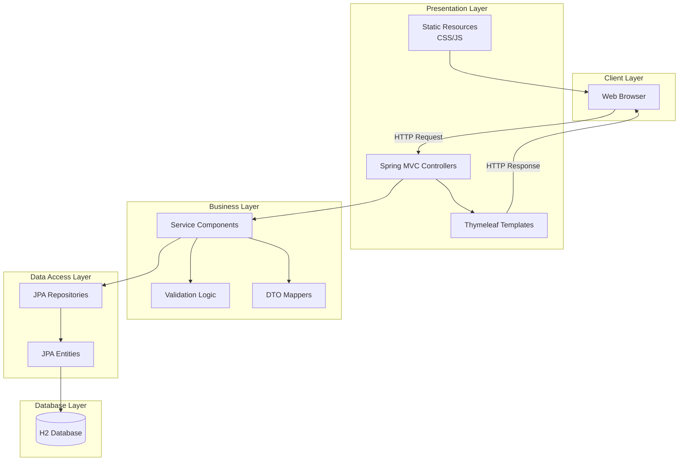

# 設計文書

## 概要

TODOタスク管理システムは、レイヤードアーキテクチャとMVCパターンを採用し、Spring Bootフレームワークを基盤として構築されるWebアプリケーションです。JPA/Hibernateによるデータ永続化層、Thymeleafベースのプレゼンテーション層、H2 Databaseによる軽量なデータストレージを組み合わせ、スケーラブルで保守性の高いタスク管理機能を提供します。システムは責務分離の原則に基づき、各層が明確な役割を持つことで、将来の拡張や変更に柔軟に対応可能な設計となっています。

## アーキテクチャ

### システム構成



### アーキテクチャパターン

**レイヤードアーキテクチャ + MVCパターン**

選定理由：
- **責務の明確な分離**: 各層が特定の責務を持ち、依存関係が一方向となることで保守性が向上
- **Spring Bootとの親和性**: フレームワークが提供する機能と自然に統合
- **テスタビリティ**: 各層を独立してテスト可能
- **段階的な開発**: 層ごとに開発・テストを進められる
- **標準的なパターン**: 開発者にとって理解しやすく、学習コストが低い

### 技術構成

| レイヤー | 技術要素 | 役割 | 選定理由 |
|---------|----------|------|----------|
| プレゼンテーション | Spring MVC, Thymeleaf | UIレンダリング、リクエスト処理 | サーバーサイドレンダリングによる高速な初期表示、SEO対応 |
| ビジネスロジック | Spring Service | 業務ロジック実装 | トランザクション管理、ビジネスルールの集約 |
| データアクセス | Spring Data JPA | データ永続化 | ボイラープレートコードの削減、型安全なクエリ |
| データベース | H2 Database | データストレージ | 開発環境での高速起動、組み込み可能、本番環境への移行容易性 |
| 検証 | Bean Validation | 入力検証 | 宣言的なバリデーション、再利用可能な制約定義 |
| ログ | SLF4J + Logback | ログ出力 | 柔軟な設定、パフォーマンス、Spring Bootのデフォルト |

## システム設計

### モジュール構成

```
todo-management-system/
├── presentation/
│   ├── controller/
│   │   ├── TodoController
│   │   ├── ErrorController
│   │   └── GlobalExceptionHandler
│   ├── dto/
│   │   ├── TodoCreateRequest
│   │   ├── TodoUpdateRequest
│   │   └── TodoResponse
│   └── view/
│       ├── templates/
│       └── static/
├── business/
│   ├── service/
│   │   ├── TodoService
│   │   └── TodoServiceImpl
│   ├── validator/
│   │   └── TodoValidator
│   └── mapper/
│       └── TodoMapper
├── data/
│   ├── entity/
│   │   └── TodoEntity
│   ├── repository/
│   │   └── TodoRepository
│   └── config/
│       └── DatabaseConfig
└── common/
    ├── exception/
    │   ├── TodoNotFoundException
    │   └── ValidationException
    └── constant/
        └── MessageConstants
```

### コンポーネント設計

#### Presentation Layer Components

```
Component: TodoController
Responsibility: HTTPリクエストの受付とレスポンスの生成、ビュー制御

Interface:
  operations:
    - listTodos() -> ModelAndView
    - showCreateForm() -> ModelAndView
    - createTodo(TodoCreateRequest) -> RedirectView
    - showEditForm(Long id) -> ModelAndView
    - updateTodo(Long id, TodoUpdateRequest) -> RedirectView
    - deleteTodo(Long id) -> RedirectView
    - toggleComplete(Long id) -> RedirectView

Dependencies:
  - TodoService: ビジネスロジックの実行
  - TodoMapper: DTOとエンティティの変換

Events:
  - triggers: FlashMessage when CRUD操作成功/失敗
  - listens: ValidationException from Service層
```

#### Business Layer Components

```
Component: TodoService
Responsibility: TODOアイテムに関するビジネスロジックとトランザクション管理

Interface:
  operations:
    - findAll() -> List<TodoDTO>
    - findById(Long id) -> TodoDTO
    - create(TodoCreateDTO) -> TodoDTO
    - update(Long id, TodoUpdateDTO) -> TodoDTO
    - delete(Long id) -> void
    - toggleComplete(Long id) -> TodoDTO

Dependencies:
  - TodoRepository: データアクセス操作
  - TodoValidator: ビジネスルール検証
  - TodoMapper: エンティティとDTOの変換

Events:
  - triggers: AuditEvent when データ変更操作
  - listens: TransactionEvent from Spring Framework
```

#### Data Layer Components

```
Component: TodoRepository
Responsibility: データベースアクセスとCRUD操作の実装

Interface:
  operations:
    - save(TodoEntity) -> TodoEntity
    - findById(Long) -> Optional<TodoEntity>
    - findAll() -> List<TodoEntity>
    - findAllByOrderByCreatedAtDesc() -> List<TodoEntity>
    - delete(TodoEntity) -> void
    - existsById(Long) -> boolean

Dependencies:
  - JpaRepository: Spring Data JPAの基本機能
  - EntityManager: カスタムクエリ実行（必要時）

Events:
  - triggers: EntityLifecycleEvent when エンティティ状態変更
```

### データフロー

#### TODO作成フロー

```
Flow: CreateTodoFlow
Trigger: POSTリクエスト to /todos/create

Steps:
  1. リクエスト受信とDTO変換 (TodoController)
  2. 入力値バリデーション (TodoValidator)
  3. ビジネスロジック実行 (TodoService)
     - タイムスタンプ付与
     - 初期ステータス設定
  4. エンティティ永続化 (TodoRepository)
  5. 成功メッセージ生成 (TodoController)
  6. 一覧画面へリダイレクト (TodoController)

Data Transformation:
  Input: TodoCreateRequest {title, description}
  → TodoCreateDTO {title, description, createdAt}
  → TodoEntity {id, title, description, completed, createdAt, updatedAt}
  Output: RedirectView with FlashAttribute

Error Scenarios:
  - ValidationError -> ValidationException -> エラーページ表示
  - DatabaseError -> DataAccessException -> 500エラーページ
```

#### TODO更新フロー

```
Flow: UpdateTodoFlow
Trigger: POSTリクエスト to /todos/{id}/edit

Steps:
  1. リクエスト受信とID検証 (TodoController)
  2. 既存エンティティ取得 (TodoService → TodoRepository)
  3. 更新内容バリデーション (TodoValidator)
  4. エンティティ更新 (TodoService)
     - 更新日時の記録
     - 楽観的ロック確認
  5. 変更内容永続化 (TodoRepository)
  6. 成功メッセージ生成 (TodoController)
  7. 一覧画面へリダイレクト (TodoController)

Data Transformation:
  Input: TodoUpdateRequest {title, description}
  → TodoUpdateDTO {id, title, description, updatedAt}
  → TodoEntity (updated fields)
  Output: RedirectView with FlashAttribute

Error Scenarios:
  - EntityNotFound -> TodoNotFoundException -> 404エラーページ
  - OptimisticLockException -> 競合エラーメッセージ
```

## データ設計

### データモデル

```
Entity: Todo
Attributes:
  - id: Long [primary_key, auto_increment]
  - title: String(100) [not_null]
  - description: String(500) [nullable]
  - completed: Boolean [not_null, default_false]
  - created_at: LocalDateTime [not_null, default_current]
  - updated_at: LocalDateTime [nullable]
  - completed_at: LocalDateTime [nullable]
  - version: Long [not_null, default_0] // 楽観的ロック用

Relationships:
  - なし（単一エンティティ）

Business Rules:
  - titleは必須かつ100文字以内
  - descriptionは500文字以内
  - completedがtrueに変更時、completed_atを記録
  - completedがfalseに変更時、completed_atをnullに設定
  - 更新時は必ずupdated_atを更新
```

### データベース設計

#### テーブル定義

```sql
CREATE TABLE todo (
    id BIGINT AUTO_INCREMENT PRIMARY KEY,
    title VARCHAR(100) NOT NULL,
    description VARCHAR(500),
    completed BOOLEAN NOT NULL DEFAULT FALSE,
    created_at TIMESTAMP NOT NULL DEFAULT CURRENT_TIMESTAMP,
    updated_at TIMESTAMP,
    completed_at TIMESTAMP,
    version BIGINT NOT NULL DEFAULT 0
);

-- インデックス
CREATE INDEX idx_todo_created_at ON todo(created_at DESC);
CREATE INDEX idx_todo_completed ON todo(completed);
```

#### 制約設計

- **主キー制約**: idカラムに設定
- **NOT NULL制約**: title, completed, created_at, version
- **文字長制約**: title(100), description(500)
- **デフォルト値**: completed(false), created_at(現在時刻), version(0)

#### インデックス戦略

- **プライマリインデックス**: id（主キー）
- **セカンダリインデックス**:
  - created_at DESC: 一覧表示時のソート性能向上
  - completed: ステータスフィルタリング性能向上（将来拡張用）

### データアクセスパターン

```
Pattern: Repository Pattern with Spring Data JPA

実装方針:
- 基本的なCRUD操作はJpaRepositoryのデフォルト実装を利用
- カスタムクエリは@Queryアノテーションまたはメソッド名規約で定義
- 複雑なクエリはSpecificationパターンを利用（将来拡張時）
- N+1問題を避けるため、必要に応じてフェッチ戦略を調整

アクセスパターン:
1. 一覧取得: findAllByOrderByCreatedAtDesc()
2. 単一取得: findById(id)
3. 作成: save(entity)
4. 更新: save(entity) // JPAの変更検知機能を利用
5. 削除: deleteById(id)
6. 存在確認: existsById(id)
```

## インターフェース設計

### 外部インターフェース

#### RESTful URL設計

| メソッド | エンドポイント | 機能 | リクエスト | レスポンス |
|---------|---------------|------|-----------|------------|
| GET | / | TODO一覧表示 | - | HTML (todo/list) |
| GET | /todos/new | 作成フォーム表示 | - | HTML (todo/form) |
| POST | /todos | TODO作成 | TodoCreateRequest | Redirect to / |
| GET | /todos/{id}/edit | 編集フォーム表示 | - | HTML (todo/edit) |
| POST | /todos/{id} | TODO更新 | TodoUpdateRequest | Redirect to / |
| POST | /todos/{id}/delete | TODO削除 | - | Redirect to / |
| POST | /todos/{id}/toggle | 完了状態切り替え | - | Redirect to / |
| GET | /h2-console | H2コンソール | - | H2 Console UI |

#### リクエスト/レスポンス定義

```
TodoCreateRequest:
{
  "title": "string, required, max:100",
  "description": "string, optional, max:500"
}

TodoUpdateRequest:
{
  "title": "string, required, max:100",
  "description": "string, optional, max:500"
}

TodoResponse:
{
  "id": "number",
  "title": "string",
  "description": "string",
  "completed": "boolean",
  "createdAt": "datetime",
  "updatedAt": "datetime",
  "completedAt": "datetime"
}
```

### 内部インターフェース

#### レイヤー間インターフェース

```
Controller → Service:
- メソッド呼び出しによる同期通信
- DTOオブジェクトによるデータ受け渡し
- 例外によるエラー通知

Service → Repository:
- Spring Data JPAインターフェース経由
- エンティティオブジェクトの操作
- Optional型による存在確認

Service → Validator:
- メソッド呼び出しによる検証
- ValidationResultオブジェクトによる結果返却
- カスタム例外による検証エラー通知
```

## 品質設計

### エラーハンドリング

#### エラー分類と処理方針

| エラー種別 | HTTPステータス | 処理方針 | ユーザー表示 |
|-----------|---------------|----------|-------------|
| バリデーションエラー | 400 | フォームに再表示 | フィールドごとのエラーメッセージ |
| 存在しないリソース | 404 | カスタム404ページ | 「ページが見つかりません」 |
| 権限エラー | 403 | カスタム403ページ | 「アクセス権限がありません」 |
| サーバーエラー | 500 | カスタム500ページ | 「一時的な問題が発生しました」 |
| DB接続エラー | 503 | メンテナンスページ | 「メンテナンス中です」 |

#### 例外処理戦略

```
GlobalExceptionHandler設計:

@ControllerAdvice
class GlobalExceptionHandler {
  
  @ExceptionHandler(ValidationException.class)
  → フォームエラー表示、元の画面に戻る
  
  @ExceptionHandler(TodoNotFoundException.class)
  → 404エラーページ表示
  
  @ExceptionHandler(DataAccessException.class)
  → エラーログ記録、503エラーページ表示
  
  @ExceptionHandler(Exception.class)
  → エラーID生成、ログ記録、500エラーページ表示
}
```

#### 復旧戦略

- **リトライ機能**: DB接続エラー時は3回まで自動リトライ（指数バックオフ）
- **トランザクションロールバック**: データ不整合を防ぐため自動ロールバック
- **キャッシュクリア**: エラー発生時は関連キャッシュをクリア
- **ユーザーガイド**: エラーページに「ホームに戻る」リンクを配置

### テスト戦略

#### テストレベルと観点

| テストレベル | 対象 | テスト観点 | ツール |
|-------------|------|-----------|--------|
| 単体テスト | Service, Validator | ビジネスロジック、バリデーション | JUnit 5, Mockito |
| 統合テスト | Repository | データアクセス、クエリ動作 | @DataJpaTest |
| 統合テスト | Controller | リクエスト処理、レスポンス | @WebMvcTest |
| E2Eテスト | 全体 | ユーザーシナリオ | @SpringBootTest |

#### テストデータ戦略

```
テストデータ管理:

1. テストフィクスチャ:
   - TodoFixture: 標準的なTODOデータ
   - InvalidTodoFixture: バリデーションエラー用データ
   
2. データベース初期化:
   - @Sql: テストごとにクリーンなデータ
   - @DirtiesContext: コンテキストリセット
   
3. モックデータ:
   - Mockito.when(): サービス層のモック
   - @MockBean: Spring Bootテスト用モック
```

### パフォーマンス設計

#### 性能要件と目標

| 項目 | 目標値 | 測定方法 |
|------|--------|----------|
| ページ応答時間 | < 200ms | Spring Boot Actuator |
| DB クエリ時間 | < 50ms | Hibernate Statistics |
| 同時接続数 | 100ユーザー | JMeter負荷テスト |
| メモリ使用量 | < 512MB | JVM Monitoring |

#### 最適化戦略

1. **データベース最適化**
   - インデックスによるクエリ高速化
   - N+1問題の回避（必要に応じてJOIN FETCH）
   - コネクションプーリング（HikariCP）

2. **アプリケーション最適化**
   - テンプレートキャッシュ（Thymeleaf）
   - 静的リソースのキャッシュヘッダー設定
   - 非同期処理（将来の大量データ処理用）

3. **フロントエンド最適化**
   - CSS/JSの最小化と結合
   - 画像の遅延読み込み
   - CDN利用（Bootstrap等のライブラリ）

#### 監視項目

- **アプリケーションメトリクス**: CPU使用率、メモリ使用量、スレッド数
- **HTTPメトリクス**: リクエスト数、レスポンスタイム、エラー率
- **データベースメトリクス**: クエリ実行時間、コネクション数、デッドロック
- **ビジネスメトリクス**: TODO作成数、完了率、アクティブユーザー数

### セキュリティ設計

#### 脅威分析

| 脅威 | リスクレベル | 対策 |
|------|------------|------|
| SQLインジェクション | 高 | JPA/Hibernateのパラメータバインディング |
| XSS攻撃 | 中 | Thymeleafの自動エスケープ機能 |
| CSRF攻撃 | 中 | Spring SecurityのCSRFトークン |
| 大量データ送信 | 低 | リクエストサイズ制限 |
| 情報漏洩 | 中 | エラーメッセージの抽象化 |

#### セキュリティ対策

1. **入力検証**
   - Bean Validationによるサーバーサイド検証
   - 文字長制限とパターンマッチング
   - HTMLタグの除去またはエスケープ

2. **出力エンコーディング**
   - Thymeleafによる自動HTMLエスケープ
   - Content-Typeヘッダーの適切な設定

3. **セッション管理**
   - HTTPOnlyクッキー
   - セッションタイムアウト設定（30分）
   - セッション固定攻撃対策

4. **ログとモニタリング**
   - セキュリティイベントのログ記録
   - 異常アクセスパターンの検知
   - 定期的なセキュリティ監査

#### 認証・認可

現在の要件では認証機能は含まれていませんが、将来の拡張に備えた設計：

```
将来の認証拡張ポイント:
- Spring Securityの統合準備
- ユーザーエンティティの追加スペース
- TODO所有者の関連付け準備
- ロールベースアクセス制御の拡張ポイント
```

## 運用設計

### デプロイメント

#### デプロイ方式

```
開発環境:
- ローカル実行: mvn spring-boot:run
- ホットリロード: Spring Boot DevTools
- データベース: H2組み込みモード

ステージング環境:
- コンテナ化: Docker
- データベース: H2サーバーモード or PostgreSQL
- リバースプロキシ: Nginx

本番環境（将来）:
- コンテナオーケストレーション: Kubernetes
- データベース: PostgreSQL/MySQL
- ロードバランサー: AWS ALB/Nginx
```

#### 環境構成

```yaml
# application.yml環境別設定

spring:
  profiles:
    active: ${SPRING_PROFILES_ACTIVE:dev}

---
spring:
  config:
    activate:
      on-profile: dev
  h2:
    console:
      enabled: true
  datasource:
    url: jdbc:h2:mem:testdb

---
spring:
  config:
    activate:
      on-profile: prod
  h2:
    console:
      enabled: false
  datasource:
    url: ${DATABASE_URL}
```

#### リリース戦略

1. **ブルーグリーンデプロイメント**
   - 新バージョンを別環境にデプロイ
   - ヘルスチェック確認後に切り替え
   - 問題発生時は即座にロールバック

2. **データベースマイグレーション**
   - Flywayによるスキーマバージョン管理
   - 後方互換性を保つ段階的な変更
   - ロールバックスクリプトの準備

### 監視・ログ

#### 監視項目と閾値

```
アプリケーション監視:
- ヘルスチェック: /actuator/health (期待値: UP)
- メトリクス: /actuator/metrics
  - heap.used < 400MB (警告)
  - http.server.requests.95percentile < 500ms
  - http.server.requests.errors.rate < 1%

インフラ監視:
- CPU使用率 < 70% (警告), < 90% (クリティカル)
- メモリ使用率 < 80% (警告), < 95% (クリティカル)
- ディスク使用率 < 70% (警告), < 90% (クリティカル)
```

#### ログ設計

```xml
<!-- logback.xml設定 -->
<configuration>
  <appender name="FILE" class="ch.qos.logback.core.rolling.RollingFileAppender">
    <file>logs/application.log</file>
    <rollingPolicy class="ch.qos.logback.core.rolling.SizeAndTimeBasedRollingPolicy">
      <fileNamePattern>logs/application-%d{yyyy-MM-dd}.%i.log</fileNamePattern>
      <maxFileSize>10MB</maxFileSize>
      <maxHistory>10</maxHistory>
    </rollingPolicy>
    <encoder>
      <pattern>%d{ISO8601} [%thread] %-5level %logger{36} - %msg%n</pattern>
    </encoder>
  </appender>
  
  <logger name="com.example.todo" level="INFO"/>
  <logger name="org.springframework.web" level="DEBUG"/>
  <logger name="org.hibernate.SQL" level="DEBUG"/>
  
  <root level="INFO">
    <appender-ref ref="FILE"/>
    <appender-ref ref="CONSOLE"/>
  </root>
</configuration>
```

#### アラート設計

| アラート条件 | 重要度 | 通知先 | 対応 |
|------------|--------|--------|------|
| アプリケーション停止 | Critical | オンコール担当 | 即座に再起動 |
| エラー率 > 5% | High | 開発チーム | ログ調査、原因特定 |
| レスポンスタイム > 1秒 | Medium | 開発チーム | パフォーマンス調査 |
| ディスク使用率 > 90% | High | 運用チーム | ログローテーション確認 |

### 保守・運用

#### バックアップ戦略

```
バックアップ計画:

1. データベース:
   - 日次: フルバックアップ (深夜2:00)
   - 時間毎: 増分バックアップ
   - 保持期間: 7日間（日次）、24時間（時間毎）

2. アプリケーションログ:
   - 日次: ログファイルのアーカイブ
   - 保持期間: 30日間
   - 保存先: S3またはNFS

3. 設定ファイル:
   - Gitによるバージョン管理
   - 環境変数による機密情報管理
```

#### 復旧手順

```
障害復旧手順:

1. アプリケーション障害:
   a. ヘルスチェック確認
   b. アプリケーション再起動
   c. ログ確認と原因調査
   d. 必要に応じて前バージョンへロールバック

2. データベース障害:
   a. 接続確認
   b. データベースサービス再起動
   c. 最新バックアップからリストア（必要時）
   d. データ整合性確認

3. 完全障害時:
   a. 新環境の構築
   b. 最新バックアップからデータリストア
   c. アプリケーションデプロイ
   d. 動作確認とDNS切り替え
```

#### メンテナンス手順

```
定期メンテナンス:

毎週:
- ログファイルのローテーション確認
- ディスク使用量確認
- パフォーマンスメトリクス確認

毎月:
- セキュリティパッチ適用
- 依存ライブラリの更新確認
- バックアップリストアテスト

四半期:
- パフォーマンステスト実施
- 災害復旧訓練
- セキュリティ監査
```

## 実装優先順位と段階的開発

### フェーズ1: 基本機能実装（1-2週間）
1. プロジェクト初期設定とデータベース構成
2. エンティティとリポジトリ層の実装
3. 基本的なCRUD機能のサービス層実装
4. コントローラーと基本的なビュー実装
5. バリデーション機能の実装

### フェーズ2: UI/UX改善（1週間）
1. Bootstrapによるデザイン適用
2. レスポンシブデザイン対応
3. フラッシュメッセージ機能
4. エラーページのカスタマイズ
5. フォームのユーザビリティ改善

### フェーズ3: 品質向上（1週間）
1. 包括的なエラーハンドリング
2. ログ機能の実装と設定
3. 単体テスト・統合テストの作成
4. パフォーマンス最適化
5. セキュリティ対策の実装

### フェーズ4: 運用準備（3-5日）
1. 環境別設定の整備
2. デプロイメントスクリプト作成
3. 監視設定（Spring Boot Actuator）
4. ドキュメント作成
5. 運用手順書の整備

## 拡張性考慮事項

### 将来の機能拡張ポイント

1. **ユーザー管理機能**
   - 認証・認可システムの追加
   - マルチテナント対応
   - ユーザーごとのTODO管理

2. **高度な機能**
   - カテゴリー/タグ機能
   - 期限管理と通知
   - 優先度設定
   - 検索・フィルタリング機能
   - TODO共有機能

3. **外部連携**
   - REST API化
   - カレンダー連携
   - 通知サービス連携（メール、Slack等）

4. **スケーラビリティ**
   - キャッシュ層の追加（Redis）
   - 読み書き分離
   - マイクロサービス化の準備

### 技術的な拡張準備

- **インターフェース分離**: 将来のAPI化に備えたサービス層の設計
- **イベント駆動**: ドメインイベントの発行準備
- **プラグイン機構**: 機能追加のための拡張ポイント設計
- **設定の外部化**: 環境変数による柔軟な設定管理