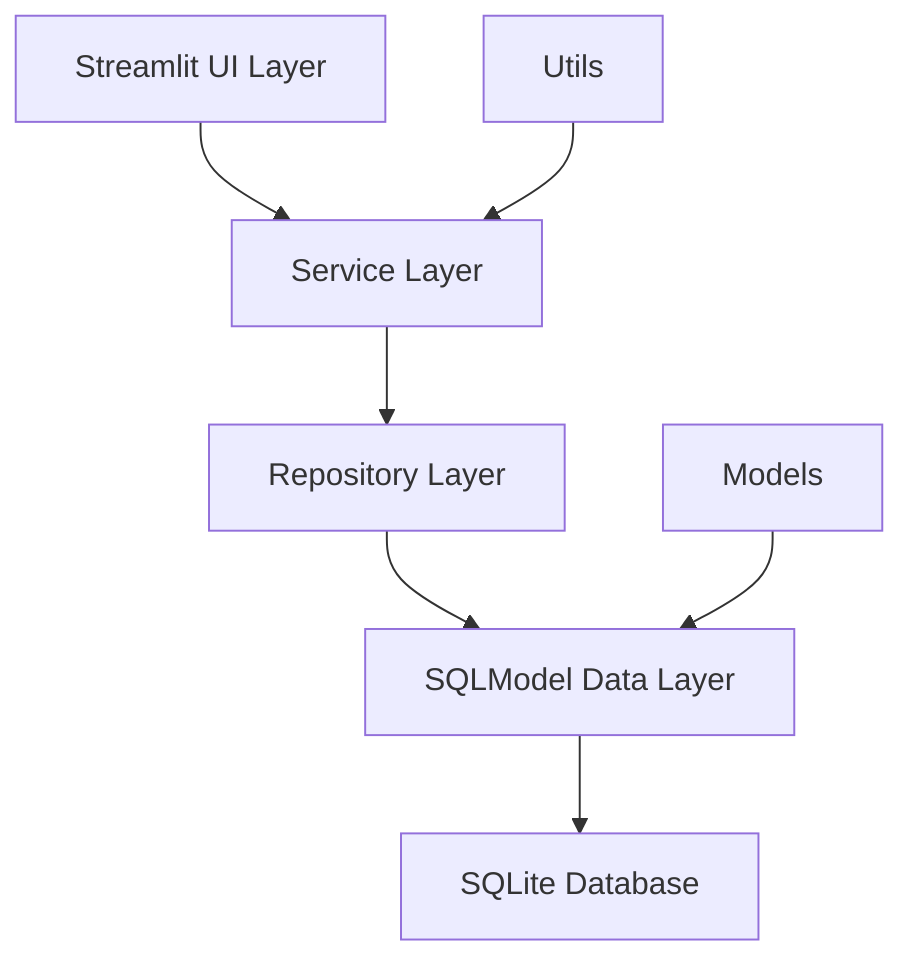

# 設計文書

## 概要

Streamlitを使用したWebベースの商品管理システムの設計文書です。SQLModelを使用したデータベースアクセス、モジュラーなアーキテクチャ、ユーザーフレンドリーなインターフェースを特徴とします。

## アーキテクチャ

### システム構成



### レイヤー構成

1. **UI Layer (Streamlit)**: ユーザーインターフェース、フォーム、表示ロジック
2. **Service Layer**: ビジネスロジック、バリデーション、データ変換
3. **Repository Layer**: データアクセス抽象化、CRUD操作
4. **Data Layer (SQLModel)**: データモデル定義、データベーススキーマ
5. **Database Layer (SQLite)**: データ永続化

## コンポーネントとインターフェース

### ディレクトリ構造

```
product-management-system/
├── app.py                 # メインStreamlitアプリケーション
├── models/
│   ├── __init__.py
│   └── product.py         # 商品データモデル
├── repositories/
│   ├── __init__.py
│   └── product_repository.py  # 商品データアクセス
├── services/
│   ├── __init__.py
│   └── product_service.py     # 商品ビジネスロジック
├── utils/
│   ├── __init__.py
│   ├── database.py        # データベース接続管理
│   └── validators.py      # バリデーション関数
├── pages/
│   ├── __init__.py
│   ├── product_list.py    # 商品一覧ページ
│   ├── product_form.py    # 商品登録・編集ページ
│   └── product_search.py  # 商品検索ページ
├── requirements.txt       # 依存関係
├── README.md             # セットアップ手順
└── database.db           # SQLiteデータベースファイル
```

### 主要コンポーネント

#### 1. データモデル (models/product.py)

```python
from sqlmodel import SQLModel, Field
from datetime import datetime
from typing import Optional

class Product(SQLModel, table=True):
    id: Optional[int] = Field(default=None, primary_key=True)
    name: str = Field(max_length=100)
    price: float = Field(gt=0)
    category: str = Field(max_length=50)
    stock_quantity: int = Field(ge=0)
    description: Optional[str] = Field(default=None, max_length=500)
    created_at: datetime = Field(default_factory=datetime.now)
    updated_at: Optional[datetime] = Field(default=None)
```

#### 2. リポジトリ (repositories/product_repository.py)

```python
from typing import List, Optional
from sqlmodel import Session, select
from models.product import Product

class ProductRepository:
    def __init__(self, session: Session):
        self.session = session
    
    def create(self, product: Product) -> Product
    def get_by_id(self, product_id: int) -> Optional[Product]
    def get_all(self, offset: int = 0, limit: int = 100) -> List[Product]
    def update(self, product: Product) -> Product
    def delete(self, product_id: int) -> bool
    def search_by_name(self, name: str) -> List[Product]
    def filter_by_category(self, category: str) -> List[Product]
    def filter_by_price_range(self, min_price: float, max_price: float) -> List[Product]
```

#### 3. サービス (services/product_service.py)

```python
from typing import List, Optional
from repositories.product_repository import ProductRepository
from models.product import Product
from utils.validators import validate_product

class ProductService:
    def __init__(self, repository: ProductRepository):
        self.repository = repository
    
    def create_product(self, product_data: dict) -> Product
    def get_product(self, product_id: int) -> Optional[Product]
    def get_all_products(self, page: int = 1, per_page: int = 10) -> List[Product]
    def update_product(self, product_id: int, product_data: dict) -> Product
    def delete_product(self, product_id: int) -> bool
    def search_products(self, search_term: str) -> List[Product]
    def filter_products(self, filters: dict) -> List[Product]
```

#### 4. Streamlitページ

- **app.py**: メインアプリケーション、ナビゲーション
- **pages/product_list.py**: 商品一覧表示、ページネーション
- **pages/product_form.py**: 商品登録・編集フォーム
- **pages/product_search.py**: 検索・フィルタリング機能

## データモデル

### 商品テーブル (products)

| カラム名 | データ型 | 制約 | 説明 |
|---------|---------|------|------|
| id | INTEGER | PRIMARY KEY, AUTO INCREMENT | 商品ID |
| name | VARCHAR(100) | NOT NULL | 商品名 |
| price | DECIMAL(10,2) | NOT NULL, > 0 | 価格 |
| category | VARCHAR(50) | NOT NULL | カテゴリ |
| stock_quantity | INTEGER | NOT NULL, >= 0 | 在庫数 |
| description | TEXT | NULL | 商品説明 |
| created_at | DATETIME | NOT NULL, DEFAULT NOW() | 作成日時 |
| updated_at | DATETIME | NULL | 更新日時 |

### データベース設計の考慮事項

- **正規化**: 現在は単一テーブル設計、将来的にカテゴリテーブルの分離を検討
- **インデックス**: name、category、priceにインデックスを設定
- **制約**: 価格は正の値、在庫数は非負の値
- **監査**: created_at、updated_atで変更履歴を追跡

## エラーハンドリング

### エラー分類と対応

1. **バリデーションエラー**
   - 必須フィールドの未入力
   - 数値フィールドの不正な値
   - 文字列長の制限超過
   - 対応: Streamlitのst.errorでユーザーに表示

2. **データベースエラー**
   - 接続エラー
   - SQL実行エラー
   - 制約違反
   - 対応: ログ出力とユーザーフレンドリーなエラーメッセージ

3. **システムエラー**
   - ファイルアクセスエラー
   - メモリ不足
   - 対応: 例外キャッチとグレースフルな処理

### エラーハンドリング戦略

```python
# utils/error_handler.py
import logging
import streamlit as st
from typing import Callable, Any

def handle_database_error(func: Callable) -> Callable:
    def wrapper(*args, **kwargs) -> Any:
        try:
            return func(*args, **kwargs)
        except DatabaseError as e:
            logging.error(f"Database error: {e}")
            st.error("データベースエラーが発生しました。しばらく待ってから再試行してください。")
        except ValidationError as e:
            st.error(f"入力エラー: {e}")
        except Exception as e:
            logging.error(f"Unexpected error: {e}")
            st.error("予期しないエラーが発生しました。")
    return wrapper
```

## テスト戦略

### テストレベル

1. **単体テスト**
   - モデルのバリデーション
   - リポジトリのCRUD操作
   - サービスのビジネスロジック
   - ユーティリティ関数

2. **統合テスト**
   - データベース接続
   - サービス-リポジトリ間の連携
   - エンドツーエンドのデータフロー

3. **UIテスト**
   - Streamlitコンポーネントの動作
   - フォームの送信
   - ページ遷移

### テストツール

- **pytest**: 単体テスト・統合テストフレームワーク
- **pytest-mock**: モックオブジェクト作成
- **sqlmodel**: テスト用インメモリデータベース
- **streamlit-testing**: Streamlit UIテスト（将来的に検討）

### テストデータ管理

```python
# tests/fixtures.py
import pytest
from sqlmodel import Session, create_engine
from models.product import Product

@pytest.fixture
def test_session():
    engine = create_engine("sqlite:///:memory:")
    with Session(engine) as session:
        yield session

@pytest.fixture
def sample_product():
    return Product(
        name="テスト商品",
        price=1000.0,
        category="テストカテゴリ",
        stock_quantity=10,
        description="テスト用の商品です"
    )
```

## パフォーマンス考慮事項

### データベース最適化

- **インデックス戦略**: 検索頻度の高いカラムにインデックス設定
- **クエリ最適化**: N+1問題の回避、適切なJOIN使用
- **ページネーション**: 大量データの効率的な表示

### Streamlit最適化

- **セッション状態管理**: st.session_stateの適切な使用
- **キャッシュ活用**: @st.cacheデコレータでデータベースクエリをキャッシュ
- **レスポンシブデザイン**: モバイル対応のレイアウト

### メモリ管理

- **データベース接続**: 適切な接続プールの使用
- **大量データ処理**: チャンク処理とストリーミング
- **ガベージコレクション**: 不要なオブジェクトの適切な解放

## セキュリティ考慮事項

### データ保護

- **SQLインジェクション対策**: SQLModelのパラメータ化クエリ使用
- **入力検証**: 全ての入力データのバリデーション
- **データサニタイゼーション**: XSS攻撃の防止

### アクセス制御

- **認証**: 将来的にStreamlit-Authenticatorの導入を検討
- **認可**: ロールベースのアクセス制御
- **セッション管理**: 適切なセッションタイムアウト

### ログ管理

- **監査ログ**: 重要な操作の記録
- **エラーログ**: システムエラーの追跡
- **アクセスログ**: ユーザーアクセスの記録

## 運用・保守

### 監視

- **ヘルスチェック**: アプリケーションの稼働状況監視
- **パフォーマンス監視**: レスポンス時間、メモリ使用量
- **エラー監視**: エラー発生率、エラーパターン

### バックアップ

- **データベースバックアップ**: 定期的なSQLiteファイルのバックアップ
- **設定ファイルバックアップ**: アプリケーション設定の保存
- **復旧手順**: データ復旧の手順書作成

### デプロイメント

- **環境分離**: 開発、テスト、本番環境の分離
- **依存関係管理**: requirements.txtの適切な管理
- **設定管理**: 環境別設定ファイルの管理